# Chrome Bridge 2.0: Persistent Python REPL Architecture Specification

**Status**: Ready for Implementation  
**Version**: 2.0.0-draft  
**Architecture Map**: [.scratch/python-repl-runtime/map.md](map.md)  
**Domain Model**: [CONTEXT.md](../../CONTEXT.md)  

---

## 1. Architectural Overview

Antigravity Chrome Bridge 2.0 transforms browser automation from a high-overhead, multi-tool JSON-RPC wrapper into a **Stateful, Persistent Python REPL Runtime Layer**. The AI Driver interacts with Google Chrome exclusively via high-level procedural Python code executed through a single FastMCP tool: `execute_python(code)`.

```mermaid
flowchart LR
    subgraph AgentClient["AI Driver / Assistant (LLM)"]
        A["Driver (Claude / Gemini / Antigravity)"]
    end

    subgraph FastMCPServer["MCP Layer (mcp-server.py)"]
        B["execute_python(code)"]
        C["PythonReplSession (In-Memory AST Engine)"]
    end

    subgraph PythonSDK["Injected Python Standard Library"]
        D["chrome Singleton / Tab Handles"]
        E["OutputBudgetFormatter"]
    end

    subgraph NativeBridge["Native IPC Layer"]
        F["/tmp/chrome_bridge.sock (Unix Domain Socket)"]
        G["native-host.mjs (Native Messaging Host)"]
    end

    subgraph ChromeBrowser["Google Chrome Instance"]
        H["Extension Service Worker"]
        I["Content Script (TreeWalker & AccName Engine)"]
        J["Live Web Pages & DOM"]
    end

    A -->|"execute_python(code)"| B
    B --> C
    C --> D
    D -->|"Synchronous Socket Call"| F
    F --> G
    G -->|"Chrome Native Messaging"| H
    H -->|"tabs.sendMessage"| I
    I --> J
    C --> E
    E -->|"Tagged Serialized Output"| A
```

---

## 2. Core Subsystems

### 2.1 Persistent In-Process REPL Engine ([Research 01](research/01-python-repl-session-engine.md))
- **Namespace Persistence**: Single global dictionary `_globals` preserved across execution turns. User variables, imported libraries, and helper functions remain in memory.
- **Interactive AST Evaluation**:
  - Code parsed with `ast.parse(mode='exec')`.
  - Final AST statements converted from `ast.Expr` to `ast.Expression` and evaluated with `eval()` to capture return values naturally (Jupyter/IPython model).
- **Stream Redirection**: `sys.stdout` and `sys.stderr` captured via `io.StringIO()` buffers with thread-safe isolation.

### 2.2 Semantic DOM Snapshot & Ref-ID System ([Research 02](research/02-semantic-dom-snapshot-ref-id.md))
- **In-Page Traversal**: Content script uses `document.createTreeWalker()` with AccName 1.2 name computation and CSS computed visibility checks (`checkVisibility({ checkOpacity: true, checkVisibilityCSS: true })`).
- **Token Efficiency**: Compresses interactive page trees into compact indented outlines (`[#1] Button: 'Submit'`), reducing context size by **99%+** compared to raw HTML.
- **Ref-ID Registry**: Ephemeral index `window.__chrome_bridge_refs` maps lightweight numbers (`1`, `2`) directly to DOM `WeakRef` nodes.

### 2.3 Synchronous Python SDK (`chrome`) ([Research 03](research/03-chrome-python-sdk-api-surface.md))
- **Polymorphic Locators**: Accepts integer Ref-IDs (`14`), token strings (`"[#14]"` or `"#14"`), or standard CSS selectors (`"button.checkout"`).
- **Tab Handles (`Tab`)**: Scoped handles (`chrome.tab(tab_id)`, `chrome.tabs`) for deterministic multi-tab orchestration.
- **Fluent Actions**: `chrome.snapshot()`, `chrome.click(target)`, `chrome.type(target, text)`, `chrome.wait_for(target)`, `chrome.navigate(url)`.

### 2.4 Token Budgeting & Output Serialization ([Research 04](research/04-token-budgeting-output-serialization.md))
- **Dual-Layer Budgeting**:
  - *Structural Pruning*: Caps collections at 10 items (`... (N more items)`), dicts at 10 keys, and depth at 3 levels (`[... N items]`).
  - *Hard Ceiling*: 12,000 characters (~3,000 tokens) with Head-and-Tail preservation (`... [N chars omitted] ...`).
- **Tagged Output Layout**: Clean partition into `[stdout]`, `[stderr]`, and `[result]` blocks.

### 2.5 Single-Turn Self-Healing Diagnostics ([Research 05](research/05-error-recovery-diagnostic-feedback.md))
- **Diagnostic Auto-Snapshot**: On action failure (e.g. `ElementNotFoundError`), the runtime automatically injects a fresh compact Semantic DOM Snapshot into `[diagnostic_auto_snapshot]`.
- **Fuzzy Stale Matching**: When an element re-renders under a new Ref-ID, the extension suggests candidate matches: `Did you mean: [#18] (button 'Checkout')?`.
- **Action Interceptor Detection**: Reports overlay dialogs or sticky banners intercepting coordinates.

### 2.6 MCP Tool Interface & Client Packaging ([Research 06](research/06-mcp-server-tool-spec-and-config.md))
- **FastMCP Server**: `mcp-server.py` exposing a single `execute_python(code: str) -> str` tool.
- **Client Configuration**: Standardized `mcpServers` configuration for Antigravity, Claude Desktop, Cursor, and Zed.

---

## 3. Decision Log Summary

| Decision | Area | Gist | Link |
|---|---|---|---|
| **01** | REPL Engine | AST-splitting interactive execution with persistent namespace and Unix socket client | [01-python-repl-session-engine.md](issues/01-python-repl-session-engine.md) |
| **02** | DOM & Ref-ID | TreeWalker AccName 1.2 snapshotting and ephemeral `[#ref]` registry in page context | [02-semantic-dom-snapshot-ref-id.md](issues/02-semantic-dom-snapshot-ref-id.md) |
| **03** | Python SDK | Synchronous fluent `chrome` singleton + `Tab` handles with polymorphic locators | [03-chrome-python-sdk-api-surface.md](issues/03-chrome-python-sdk-api-surface.md) |
| **04** | Output Budget | Structural AST pruning + 12k char ceiling with tagged `[stdout]`/`[result]` layout | [04-token-budgeting-output-serialization.md](issues/04-token-budgeting-output-serialization.md) |
| **05** | Diagnostics | Auto-injected snapshots on exceptions, stale Ref-ID fuzzy matching, and interceptor hit-tests | [05-error-recovery-diagnostic-feedback.md](issues/05-error-recovery-diagnostic-feedback.md) |
| **06** | MCP & Config | FastMCP `execute_python` server, packaging in `pyproject.toml`, and client configuration | [06-mcp-server-tool-spec-and-config.md](issues/06-mcp-server-tool-spec-and-config.md) |

---

## 4. Implementation Readiness & Next Steps

All architectural unknowns have been resolved and documented with zero open blockers. The codebase is fully prepped for implementation:
1. Create `repl_engine.py` and `chrome_sdk.py`.
2. Update extension content scripts for TreeWalker Semantic Snapshots & Ref-ID resolution.
3. Replace Node MCP server with FastMCP `mcp-server.py`.
4. Run integration end-to-end suite with `test-full.mjs` / `pytest`.
