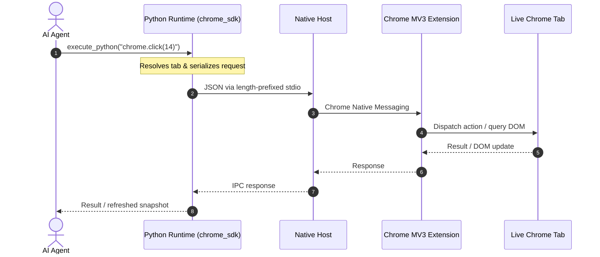
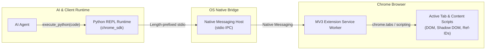

# Chrome Bridge

[](LICENSE)
[](README.md)
[](pyproject.toml)
[](extension/manifest.json)

**Connect AI agents directly to your real, logged-in Google Chrome browser.**

Chrome Bridge gives AI agents a persistent programming interface to an existing
Chrome session instead of launching a separate, empty automation browser.

- **Live User Session:** Work with the browser you already use, including its
  current tabs, cookies, authentication state, and logged-in applications.
- **Native Messaging IPC:** Connects the Python runtime to Chrome through
  Chrome Native Messaging and local IPC.
- **Compact Page Representation:** Converts large DOM structures into compact
  semantic outlines with numbered interactive references such as `[#1]` and
  `[#2]`, reducing the amount of page context an agent needs to process.
- **Stateful Python REPL:** Agents can execute procedural Python in a persistent
  runtime where variables, objects, and tab bindings survive across actions.
- **Agent-Friendly API:** Exposes browser interaction through Python and MCP,
  making it usable from coding agents and other MCP-compatible clients.

---

## Architecture & Request Flow





---

## Installation

### 1. Install Chrome Bridge

```bash
uvx --refresh antigravity-chrome-bridge setup
```

The setup command provisions the local runtime, registers the Native Messaging
Host, and configures supported agent integrations.

Supported integrations include:

- Claude Code
- Claude Desktop
- Cursor
- Antigravity CLI
- Codex CLI
- Pi Code

The installer supports macOS, Linux, and Windows.

<details>
<summary>Alternative: install from source</summary>

### macOS & Linux

```bash
git clone https://github.com/sh7vansh/chrome-bridge.git
cd chrome-bridge
./setup.sh
```

### Windows

```powershell
git clone https://github.com/sh7vansh/chrome-bridge.git
cd chrome-bridge
.\setup.ps1
```

</details>

### 2. Load the Chrome Extension

1. Open `chrome://extensions` in Chrome.
2. Enable **Developer mode**.
3. Click **Load unpacked**.
4. Select:

```text
~/.chrome-bridge/extension
```

or the `extension/` directory when running from source.

Once loaded, the Chrome Bridge extension will display its connection status in
the toolbar.

<details>
<summary>Manual MCP configuration</summary>

For an MCP-compatible client that requires manual configuration:

```json
{
  "mcpServers": {
    "chrome-bridge": {
      "command": "uvx",
      "args": ["antigravity-chrome-bridge", "mcp"]
    }
  }
}
```

</details>

---

## Remote Use

Chrome Bridge can also be exposed to an MCP client running on another machine
through `mcp-proxy`.

> **⚠️ Security warning:** This exposes the Chrome Bridge MCP endpoint over the
> network. Anyone who can reach the configured port may be able to control your
> browser through the MCP interface. Only use this on a trusted network or
> behind appropriate network access controls. Do **not** expose the endpoint
> directly to the public internet.

Install `mcp-proxy`:

```bash
uv tool install "mcp<2.0.0"
```

Then start a network endpoint for Chrome Bridge:

```bash
uvx --with "mcp<2.0.0" mcp-proxy --host 0.0.0.0 --port 8787 uvx antigravity-chrome-bridge mcp
```

The Chrome Bridge MCP endpoint is available at:

```text
http://localhost:8787
```

This makes it easy to connect through a reverse proxy, SSH tunnel, VPN, or
another tunneling/forwarding layer when a remote MCP client needs access.

---

## CLI & Diagnostics

Chrome Bridge includes CLI utilities for installation, diagnostics, health
checks, simulation, and cleanup.

| Command | Description |
| :--- | :--- |
| `uvx antigravity-chrome-bridge setup` | Install and configure Chrome Bridge |
| `uvx antigravity-chrome-bridge doctor` | Inspect runtime, manifests, and connectivity |
| `uvx antigravity-chrome-bridge doctor --fix` | Attempt automatic repair of detected issues |
| `uvx antigravity-chrome-bridge status` | Check native host and IPC status |
| `uvx antigravity-chrome-bridge simulate` | Simulate the native messaging handshake without Chrome |
| `uvx antigravity-chrome-bridge cleanup` | Remove Chrome Bridge registrations and local runtime artifacts |

### Self-healing diagnostics

When troubleshooting:

```bash
uvx antigravity-chrome-bridge doctor --fix
uvx antigravity-chrome-bridge status
```

The goal is to make the bridge diagnosable instead of requiring users to
manually inspect native messaging manifests, permissions, and IPC state.

---

## Python SDK

The synchronous `chrome` client can be used directly from Python scripts or
from an agent's persistent Python runtime.

```python
from chrome_sdk import chrome

# Inspect the current page
print(chrome.snapshot())

# Click an element by Ref-ID
chrome.click(12)

# Type into an input and press Enter
chrome.type(3, "Search query", press_enter=True)

# Select a dropdown option
chrome.select(5, "option_value")

# Control HTML5 media
chrome.media.play_pause()
chrome.media.seek(30)

# Open and inspect another tab
tab = chrome.new_tab("https://github.com")
print(chrome.tabs)
```

### Core API

| Method | Syntax | Description |
| :--- | :--- | :--- |
| `snapshot` | `chrome.snapshot()` | Returns a compact semantic outline with interactive Ref-IDs |
| `click` | `chrome.click(id)` | Click a Ref-ID or CSS selector |
| `type` | `chrome.type(id, text, press_enter=False)` | Enter text into an input |
| `select` | `chrome.select(id, value)` | Select an option |
| `hover` | `chrome.hover(id)` | Trigger hover state |
| `scroll` | `chrome.scroll(x=0, y=500)` | Scroll the active page |
| `navigate` | `chrome.navigate(url)` | Navigate the active tab |
| `new_tab` | `chrome.new_tab(url)` | Open a new tab |
| `tabs` | `chrome.tabs` | List open tabs |
| `eval_js` | `chrome.eval_js(expr)` | Execute JavaScript in page context |
| `screenshot` | `chrome.screenshot()` | Capture the current tab |
| `media` | `chrome.media.play_pause()` | Control HTML5 media |

### Persistent state

The Python runtime is designed for multi-step workflows:

```python
tab = chrome.active_tab

page = tab.snapshot()
# ... inspect page ...

tab.click(12)
# ... later ...
tab.type(3, "hello")
```

Objects and variables can remain available between executions, allowing an
agent to build on previous browser state instead of reconstructing it for every
action.

---

## Security Model

Chrome Bridge is designed around a **local-first trust model**.

### Local bridge

Communication between the agent runtime, native host, and Chrome extension uses
local IPC and Chrome Native Messaging. Chrome Bridge does not proxy browser
traffic through a remote browser service.

### Existing browser session

Automation operates against the user's existing Chrome profile and session
rather than creating a separate automation browser.

### Untrusted web content

Content extracted from websites is treated as **untrusted external data**.
The SDK includes boundaries intended to prevent webpage content from being
mistaken for trusted agent instructions.

### Destructive-action guardrails

The SDK includes safeguards for high-impact operations such as:

- account deletion
- repository deletion
- subscription cancellation
- destructive database operations
- data-wiping actions

Intentional destructive actions can be explicitly permitted through the safety
API.

### Origin controls

Navigation can be constrained to the task's allowed origins, with explicit
mechanisms for expanding the allowed scope when a workflow requires it.

### Runaway-action detection

The SDK tracks browser actions to detect patterns such as:

- repetitive clicks
- click oscillation / ping-pong loops
- excessive consecutive scrolling

These controls are intended to reduce runaway agent behavior.

### Important trust boundary

Chrome Bridge is **not a security sandbox**.

The persistent Python runtime and operations such as JavaScript evaluation are
intentionally powerful local-agent capabilities. They should be treated as
trusted operations.

The security controls are defense-in-depth mechanisms for browser-agent
workflows; they do not guarantee protection against every malicious webpage,
browser extension, compromised local process, or other attack.

---

## Testing

Run the full test suite with:

```bash
./test.sh
```

or:

```bash
pytest tests/
```

The repository includes tests covering areas including:

- Python SDK behavior
- persistent REPL execution
- native host communication
- installation and runtime behavior
- diagnostics
- browser capabilities
- media fast paths
- security controls
- destructive-action protection
- origin restrictions
- untrusted-data handling
- runaway-action detection

---

## License

MIT License. See [LICENSE](LICENSE) for details.
