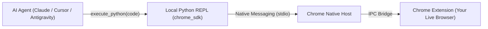

# 🌐 Chrome Bridge

[](LICENSE)
[](README.md)
[](pyproject.toml)

> **Connect AI agents directly to your real Google Chrome browser.**  
> Let Claude, Cursor, Antigravity, or custom Python scripts view open tabs, read active pages, click buttons, fill forms, and automate workflows in your logged-in browser session.

---

## 💡 What is Chrome Bridge?

Most browser automation tools (like Puppeteer or Playwright) start a fresh, empty browser window where you are logged out of everything.

**Chrome Bridge is different.** It connects directly to your **existing, everyday Chrome browser**:
- ✅ **Your Logins & Cookies Stay Intact**: Access Gmail, GitHub, dashboards, or private internal tools without logging in again.
- ✅ **Zero Network Ports or Daemons**: Communicates securely over local OS standard input/output (Chrome Native Messaging). No open ports, no web servers, no firewall warnings.
- ✅ **Token-Efficient for AI**: Converts web pages into a compact text snapshot with numbered element IDs (`[#1]`, `[#2]`), saving 99% of AI token usage compared to raw HTML.
- ✅ **Stateful Python REPL**: AI agents write procedural Python (`chrome.click(1)`) in a persistent session where variables and data persist across turns.

---

## ⚙️ How It Works



1. **AI writes Python**: The agent runs simple commands using the pre-injected `chrome` library.
2. **Local Bridge communicates**: Python sends commands to Chrome via native messaging.
3. **Chrome executes in-page**: The extension clicks, types, navigates, or takes snapshots of your active tab.

---

## 🚀 Quick Setup (Under 2 Minutes)

### Step 1: Run the Automatic Setup Script

Choose your operating system:

- **macOS & Linux:**
  ```bash
  git clone https://github.com/sh7vansh/chrome-bridge.git
  cd chrome-bridge
  ./setup.sh
  ```

- **Windows (PowerShell):**
  ```powershell
  git clone https://github.com/sh7vansh/chrome-bridge.git
  cd chrome-bridge
  .\setup.ps1
  ```

- **Or via npx (one command):**
  ```bash
  npx antigravity-chrome-bridge setup
  ```

*The setup script automatically creates the Python virtual environment, registers the Native Messaging host, and configures MCP for Claude Desktop, Cursor, and Antigravity CLI.*

---

### Step 2: Load the Extension in Chrome

1. Open Google Chrome and go to: `chrome://extensions`
2. Turn on the **Developer mode** toggle in the top-right corner.
3. Click **Load unpacked** (top-left).
4. Select the `extension` folder inside this repository (`chrome-bridge/extension`).
5. You will see the **Chrome Bridge** icon in your toolbar showing **`🟢 Connected`**.

---

### Step 3: Connect to Your Favorite AI

#### 🟣 Claude Desktop / Cursor / Antigravity (MCP)
The setup script automatically adds the configuration. If adding manually, add this to your MCP config:

```json
{
  "mcpServers": {
    "chrome-bridge": {
      "command": "python3",
      "args": ["/path/to/chrome-bridge/mcp_server.py"]
    }
  }
}
```

#### 🐍 Direct Python Usage
You can also control Chrome directly from your own Python code:

```python
from chrome_sdk import chrome

# Check the active tab
print(chrome.title)
print(chrome.url)

# View page elements with numbered Ref-IDs
print(chrome.snapshot())

# Click by element number
chrome.click(1)

# Type into search box and hit Enter
chrome.type(2, "Antigravity AI", press_enter=True)
```

---

## 📖 Python SDK Quick Reference

The synchronous `chrome` object is available out of the box:

| Action | Python Command | Description |
| :--- | :--- | :--- |
| **Inspect Page** | `chrome.snapshot()` | Returns a distilled text outline with `[#1]`, `[#2]` element IDs |
| **Click Element** | `chrome.click(14)` or `chrome.click("[#14]")` | Clicks the element by number or Ref-ID |
| **Type Text** | `chrome.type(2, "search query", press_enter=True)` | Enters text into an input or textarea |
| **Select Dropdown** | `chrome.select(5, "option_value")` | Selects an option in a `<select>` dropdown |
| **Hover** | `chrome.hover(8)` | Triggers mouse hover state |
| **Scroll** | `chrome.scroll(x=0, y=500)` | Scrolls active page |
| **Navigate** | `chrome.navigate("https://github.com")` | Navigates the active tab to a URL |
| **New Tab** | `tab = chrome.new_tab("https://news.ycombinator.com")` | Opens a new tab |
| **List Tabs** | `tabs = chrome.tabs` | Returns all open browser tabs |
| **Wait for Element** | `chrome.wait_for(10, timeout=5.0)` | Waits for element to appear on screen |
| **Run Javascript** | `chrome.eval_js("window.innerWidth")` | Evaluates Javascript expression in tab |
| **Take Screenshot** | `chrome.screenshot()` | Captures a base64 PNG screenshot of tab |

---

## 🧩 Extension Popup Features

Clicking the extension icon in Chrome opens a live dashboard:

- **📊 Live Telemetry**: Watch commands execute in real-time with category filters (`Actions`, `DOM`, `Errors`) and expandable payload inspection.
- **🔍 Ref-ID Visual Highlighter**: Click *Highlight Ref-IDs* to display floating numbers directly over interactive buttons on your web page so you can easily see what number corresponds to what element.
- **⚡ Connection Health & Latency**: Shows real-time Native Host IPC roundtrip ping (e.g. `⚡ 1.2ms`).
- **📋 1-Click Copy**: Instantly copy ready-to-paste Python driver snippets and MCP configuration JSON.

---

## 🧪 Testing

Run the comprehensive test suite to verify your setup:

```bash
./test.sh
# or
.venv/bin/pytest tests/
```

---

## 🛡️ Privacy & Security

- **Local Only**: All communication happens entirely on your local machine via standard OS input/output pipes.
- **No Cloud Servers**: No web traffic or browsing data is ever sent to external cloud proxies or servers.
- **Zero Bot Detection**: Uses your real Chrome profile and user session without triggering automated bot detection or Cloudflare blocks.

---

## 📄 License

MIT License. Feel free to use, modify, and distribute.
