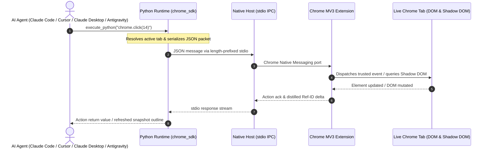
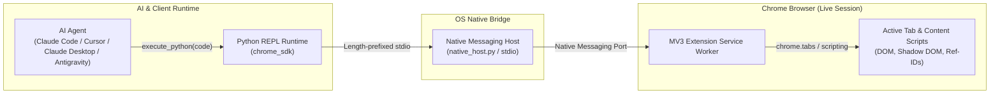

# Chrome Bridge

[](LICENSE)
[](README.md)
[](pyproject.toml)
[](extension/manifest.json)

Connect AI agents directly to your real, logged-in Google Chrome browser.

Unlike Puppeteer or Playwright which launch isolated, empty browser instances, Chrome Bridge connects to your existing browser session:
- **Live User Session:** Retains all cookies, logins, credentials, and active tab states (Gmail, GitHub, internal dashboards).
- **Native Messaging IPC:** Communicates directly with Chrome via standard Chrome Native Messaging and fast local IPC.
- **99% Token Reduction:** Translates full DOM trees into compact text outlines with numbered interactive reference IDs (`[#1]`, `[#2]`).
- **Stateful Python REPL:** Agents write procedural Python in a persistent runtime where state, variables, and tab bindings persist across turns.

---

## Architecture & Request Flow





---

## Installation (2 Steps)

### Step 1: Run the Automated Setup

```bash
uvx --refresh antigravity-chrome-bridge setup
```

This single command automatically:
- Provisions the isolated Python runtime (`~/.chrome-bridge`).
- Registers the Native Messaging Host for Chrome, Brave, and Edge across Linux, macOS, and Windows.
- Automatically configures MCP servers and skills for **Claude Code**, **Claude Desktop**, **Cursor**, **Antigravity CLI**, **Codex CLI**, and **Pi Code**.

<details>
<summary>Alternative: Install from source (for contributors)</summary>

```bash
# macOS & Linux
git clone https://github.com/sh7vansh/chrome-bridge.git && cd chrome-bridge && ./setup.sh

# Windows (PowerShell)
git clone https://github.com/sh7vansh/chrome-bridge.git; cd chrome-bridge; .\setup.ps1
```
</details>

### Step 2: Load the Extension in Chrome

1. Open Google Chrome and navigate to `chrome://extensions`.
2. Enable **Developer mode** using the toggle in the top-right corner.
3. Click **Load unpacked** (top-left) and select `~/.chrome-bridge/extension` (or `chrome-bridge/extension` if installed from source).
4. You're done! The Chrome Bridge icon in your toolbar will show connected status.

<details>
<summary>Manual MCP Configuration Reference (Optional)</summary>

If configuring a custom or manual MCP client:

```json
{
  "mcpServers": {
    "chrome-bridge": {
      "command": "uvx",
      "args": ["antigravity-chrome-bridge", "mcp"]
    }
  }
}
```
</details>

---

## CLI Commands & Diagnostics

Chrome Bridge includes pure-Python CLI utilities accessible directly via `uvx`:

| Command | Description |
| :--- | :--- |
| `uvx antigravity-chrome-bridge setup` | Runs full setup, registers native host manifests, and auto-patches MCP configs |
| `uvx antigravity-chrome-bridge doctor` | Audits runtime environment, manifests, and socket health (`--fix` to auto-repair) |
| `uvx antigravity-chrome-bridge status` | Checks native host IPC port and socket listener status |
| `uvx antigravity-chrome-bridge simulate` | Simulates native messaging stdio handshake end-to-end without Chrome running |
| `uvx antigravity-chrome-bridge cleanup` | Removes manifest registrations, launcher scripts, and socket files |

### Diagnostics & Self-Healing

If you encounter connection issues between your agent and Chrome:

```bash
# Run self-healing diagnostics and auto-repair broken manifests or permissions
uvx antigravity-chrome-bridge doctor --fix

# Check IPC socket and listener status
uvx antigravity-chrome-bridge status
```

---

## Python SDK Quick Reference

The synchronous `chrome` client is ready to use directly in Python scripts and agent REPL sessions:

```python
from chrome_sdk import chrome

# Inspect current page structure with numbered Ref-IDs
print(chrome.snapshot())

# Click button or link by element ID
chrome.click(12)

# Type into input field and submit
chrome.type(3, "Search query", press_enter=True)

# Select dropdown option
chrome.select(5, "option_value")

# Multimedia fast-path (Shadow-DOM & audio/video)
chrome.media.play_pause()
chrome.media.seek(30)

# Tab management
tab = chrome.new_tab("https://github.com")
print(chrome.tabs)
```

### Core API Methods

| Method | Syntax | Description |
| :--- | :--- | :--- |
| `snapshot` | `chrome.snapshot()` | Returns a distilled text outline of interactive elements with `[#id]` references |
| `click` | `chrome.click(id)` | Dispatches a click event to the target Ref-ID or CSS selector |
| `type` | `chrome.type(id, text, press_enter=False)` | Focuses target input and inputs text with optional Enter keypress |
| `select` | `chrome.select(id, value)` | Chooses an option in a `<select>` dropdown |
| `hover` | `chrome.hover(id)` | Triggers mouse hover state on target element |
| `scroll` | `chrome.scroll(x=0, y=500)` | Scrolls active page viewport |
| `navigate` | `chrome.navigate(url)` | Navigates active tab to specified URL |
| `new_tab` | `chrome.new_tab(url)` | Opens a new browser tab |
| `tabs` | `chrome.tabs` | Returns list of all open tabs with IDs and URLs |
| `eval_js` | `chrome.eval_js(expr)` | Executes JavaScript expression in page context and returns result |
| `screenshot` | `chrome.screenshot()` | Returns base64 PNG data of current tab |
| `media` | `chrome.media.play_pause()` | Controls active HTML5 video/audio playback |

---

## Testing

Run the test suite to verify the native host and SDK bindings:

```bash
./test.sh
# or
pytest tests/
```

---

## Security & Architecture Principles

- **Local-Only Communication:** All data transfer occurs over local standard I/O pipes. No data leaves your machine.
- **No Cloud Proxies:** All browsing sessions execute against your local Chrome application directly.
- **Bot-Detection Immunity:** Operates within your actual user profile and existing session cookies without triggering automation or CAPTCHA defenses.

---

## License

MIT License. See [LICENSE](LICENSE) for details.
